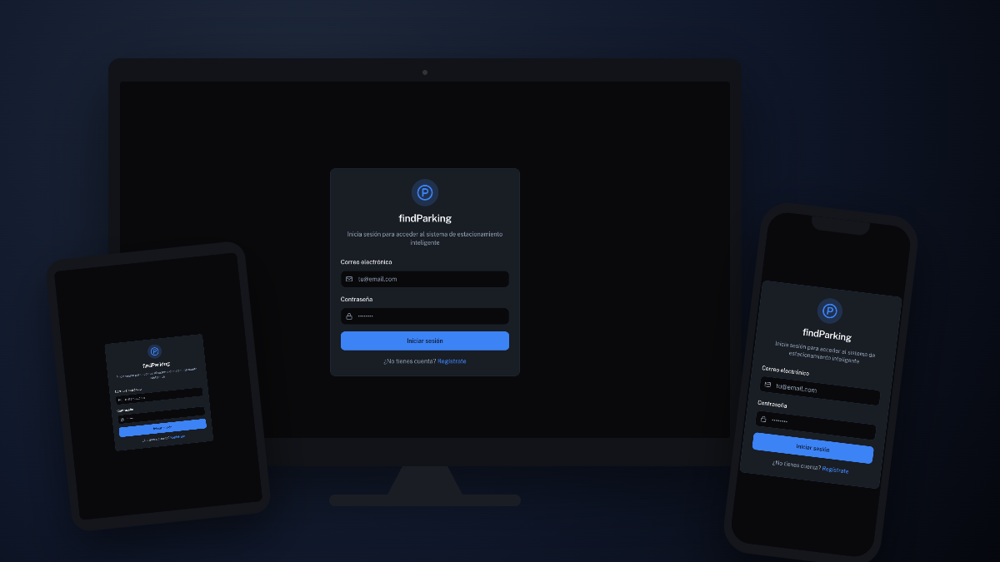

```
    _______           ______             __   _            
   / ____(_)___  ____/ / __ \____ ______/ /__(_)___  ____ _
  / /_  / / __ \/ __  / /_/ / __ `/ ___/ //_/ / __ \/ __ `/
 / __/ / / / / / /_/ / ____/ /_/ / /  / ,< / / / / / /_/ / 
/_/   /_/_/ /_/\__,_/_/    \__,_/_/  /_/|_/_/_/ /_/\__, /  
                                                  /____/ 
```

##


[](https://vercel.com/new/clone?repository-url=https%3A%2F%2Fgithub.com%2FseminarioA%2FfindParking&root-directory=ui%2Ffrontend&project-name=findparking-frontend&repository-name=findparking-frontend)



## 🦉 FPKv0.5

FindParking es una plataforma que permite determinar la ocupación de plazas de estacionamiento (libre / ocupada) a partir de streams de video. Para ello, hace uso de tecnicas de Vision por Computadora (IA).

## Tabla de Contenido
- [Acerca de](#-acerca-de)
- [Instalación](#-instalación)
  - [Instalación manual](#instalación-manual)
  - [Instalación automatica](#instalación-automatica-linuxwsl)
- [Stack](#-stack)
- [Contribuyentes](#-contribuyentes)

## 👩🏻‍💻 Acerca de
Tecnicamente, FindParking captura frames de cámaras configuradas, ejecuta detección de vehículos con YOLO + OpenCV, mapea detecciones a plazas definidas y expone la ocupación actual mediante REST y WebSockets.

### 🧩 Monolito modular
La base de código se reorganizó como un monolito modular para agrupar responsabilidades:
```
findParking/
├── infra/        # Docker Compose, gateway y despliegue
├── api/          # Módulos de autenticación, ocupación y video
├── vision/       # Procesamiento de video y streaming
├── core/         # Recursos compartidos (modelos, videos, configuraciones)
├── metrics/      # Punto de entrada para observabilidad/monitorización
├── ui/           # Frontend React
├── docs/         # Documentación UML y diagramas
└── tests/        # Pruebas de contrato e integración ligera
```

## 👩🏻‍🔬 Instalación

¡Existen dos maneras!

### Instalación manual (Linux/WSL)

#### Instalar git
```bash
sudo apt update
sudo apt install git
```

#### Clonar repositorio
```bash
git clone https://github.com/seminarioA/findParking.git
```

#### Abrir Carpeta
```bash
cd findParking
cd infra
```

#### Levantar microservicios

```bash
docker-compose -f docker-compose.yml up --build
```

### Instalación automatica (Linux/WSL)

#### Ejecutar el script
```bash
./infra/deploy.sh
```

### ¿Y como accedo al servicio?
El punto de acceso es:
- Frontend: http://<ip publica/localhost>:3000

## 💻 Stack

### IA/ML


### Back-End


### Bases de Datos


### Front-End


### DevOps


### Cloud


## 👩🏻‍🔬 Contribuyentes
### 🧑🏻‍🔬 Alejandro Seminario


Redes:

[![LinkedIn][1]][2] [![GitHub][3]][4]

[1]:  https://img.shields.io/badge/linkedin-%230077B5.svg?style=for-the-badge&logo=linkedin&logoColor=white
[2]:  https://www.linkedin.com/in/alejandroseminariomedina/

[3]:  https://img.shields.io/badge/github-%23121011.svg?style=for-the-badge&logo=github&logoColor=white
[4]:  https://github.com/seminarioA


##

```
⠀⠀⠀⠀⠀⠀⠀⠀⠀⠀⠀⠀⠀⠀⠀⣀⣼⣄⢻⣆⡀⠀⠀⠀⠀⠀⠀⠀⠀⠀⠀⠀⠀⠀⠀⠀⠀⠀⠀⠀⠀⠀⠀⠀⠀⠀⠀⠀⠀⠀⠀⠀⠀⠀⠀⠀⠀⠀⠀⠀⠀⠀⠀⠀⠀
⠀⠀⠀⠀⠀⠀⠀⠀⠀⠀⠀⠀⠀⢠⣿⣷⣿⣿⣿⣿⢹⡗⠀⠀⠀⠀⠀⠀⠀⠀⠀⠀⠀⠀⠀⠀⠀⠀⠀⠀⠀⠀⠀⠀⠀⠀⠀⠀⠀⠀⠀⠀⠀⠀⠀⠀⠀⠀⠀⠀⠀⠀⠀⠀⠀
⠀⠀⠀⠀⠀⠀⠀⠀⠀⠀⠀⠀⠀⢸⣿⣿⣿⣿⣿⣇⠈⢷⣄⠀⠀⠀⠀⠀⠀⠀⠀⠀⠀⠀⠀⠀⠀⠀⠀⠀⠀⠀⠀⠀⠀⠀⠀⠀⠀⠀⠀⠀⠀⠀⠀⠀⠀⠀⠀⢀⠀⠀⠀⠀⠀
⠀⠀⠀⠀⠀⠀⠀⠀⠀⠀⠀⠀⠀⢸⣿⣿⣿⣿⣿⡿⡆⠀⠈⣧⡀⠀⠀⠀⠀⠀⠀⠀⠀⠀⠀⠀⠀⠀⠀⠀⠀⠀⠀⠀⠀⠀⠀⠀⠀⠀⠀⠀⠀⠀⠀⠀⠀⠀⢰⣾⣿⣦⠀⡀⠀
⠀⠀⠀⠀⠀⠀⠀⠀⠀⠀⠀⠀⠀⢸⣿⣿⣿⣏⣿⣿⣽⡀⠀⠘⣷⡀⠀⠀⠀⠀⠀⠀⠀⠀⠀⠀⠀⠀⠀⠀⠀⠀⠀⠀⠀⠀⠀⠀⠀⠀⠀⠀⠀⠀⠀⠀⠀⢠⣸⣿⣿⣿⣿⣿⣄
⠀⠀⠀⠀⠀⠀⠀⠀⠀⠀⠀⠀⠀⠀⢻⣿⣿⣿⣿⣿⣿⣇⢲⡀⠈⢻⡦⠀⠀⠀⠀⠀⠀⠀⠀⠀⠀⠀⠀⠀⠀⠀⠀⠀⠀⠀⠀⠀⠀⠀⠀⠀⠀⠀⠀⠀⣴⠇⣸⣿⣿⣿⣿⣿⣿
⠀⠀⠀⠀⠀⠀⠀⠀⠀⠀⠀⠀⠀⠀⢸⣿⣿⣿⣿⠷⢻⣿⣌⣿⡆⢸⣷⠀⠀⠀⠀⠀⠀⠀⠀⠀⠀⠀⠀⠀⠀⠀⠀⠀⠀⠀⠀⠀⠀⠀⠀⠀⠀⠀⣠⣴⡏⣵⣿⣿⣿⣿⣿⣿⣿
⠀⠀⠀⠀⠀⠀⠀⠀⠀⠀⠀⠀⠀⠀⠘⢿⣿⣿⣿⣧⡼⣹⡿⢸⣧⠀⠙⣷⠀⠀⠀⠀⠀⠀⠀⠀⠀⠀⠀⠀⠀⠀⠀⠀⠀⠀⠀⠀⠀⠀⠀⠀⢠⣼⣾⡟⠉⣭⣿⣿⣭⣿⣿⣿⡇
⠀⠀⠀⠀⠀⠀⠀⠀⠀⠀⠀⠀⠀⠀⠀⠈⣿⣿⣿⣿⣧⡟⣠⡼⢿⠆⠀⠘⣷⣿⣿⣿⣿⣿⣿⣿⣿⣿⣿⣗⣲⣦⣤⣤⣀⡀⠀⠀⠀⠀⢀⣠⣿⢹⠹⠁⢲⣿⣿⣿⣾⣿⣿⡿⠀
⠀⠀⠀⠀⠀⠀⠀⠀⠀⠀⠀⠀⠀⢀⣠⣴⣾⣿⣿⣿⣿⣼⣿⣧⣾⣷⠒⠶⢿⣭⣿⠿⠿⢶⣾⡻⠋⠾⠟⠙⠿⠗⠒⣻⣿⣿⣶⣶⡶⣾⣿⡿⡾⠈⣰⣴⡿⣿⣷⣿⣿⣿⡿⠁⠀
⠀⠀⠀⠀⠀⠀⠀⠀⠀⠀⢀⣤⣾⣿⣿⣿⣿⣿⣿⣿⣿⣿⣿⣻⡟⠛⢒⣤⡄⠉⠽⠶⠤⠄⠈⢉⣀⣐⣚⡛⠓⠒⠛⠻⠀⠀⢀⣿⣦⣭⡞⣤⣶⣾⣿⣿⠻⣦⣿⣿⣿⠟⠀⠀⠀
⠀⠀⠀⠀⠀⠀⠀⠀⢀⣴⣿⡿⢛⣿⡿⢟⣿⡿⢿⣿⣿⣿⣿⠿⢰⢾⣿⣿⣾⠧⠤⢄⠴⠾⠿⣥⡤⠤⠀⢠⣄⣀⣀⠘⣷⡀⢣⣍⣉⠀⠀⠘⠻⣿⣄⣠⡟⢿⣿⣿⠏⠀⠀⠀⠀
⠀⠀⠀⠀⠀⠀⠀⣠⣿⣿⣿⣶⣿⢏⣴⡾⠛⠑⣿⣟⣑⠿⣿⣶⣾⢷⡻⣏⠀⠀⠶⠛⢶⣶⠶⠶⣤⣀⠀⢞⣉⠈⠛⠒⠿⠷⠾⣶⣧⣀⠀⠀⢀⣬⣥⢙⣿⣿⣿⠁⠀⠀⠀⠀⠀
⠀⠀⠀⠀⠀⢀⣴⣿⢟⣡⣿⣿⠟⣿⠻⠋⠀⣠⣼⡿⢿⣯⣀⠙⢿⣷⡶⣿⣿⣦⠀⠀⠀⠁⢀⠾⠋⠙⠛⠉⠹⠤⠶⣿⣷⣦⡠⢬⣛⡿⢳⠖⠋⠁⢹⣾⣿⣿⣿⠀⠀⠀⠀⠀⠀
⠀⠀⠀⠀⢠⣾⣿⣿⣿⣿⠟⣿⣾⡿⢠⣤⣾⡿⠛⠦⣤⣀⠙⢷⣾⣿⣾⣾⣿⣿⣧⣤⡀⠀⠀⠀⠀⢸⠃⠀⠀⠀⠀⠀⠚⠋⠀⠴⣏⠳⡄⠀⣀⣤⠼⣛⡿⣿⣿⡄⠀⠀⠀⠀⠀
⠀⠀⠀⢠⡾⢿⠉⣿⣿⠏⡰⠿⠋⠀⢠⣿⣟⠛⣲⣶⡶⠼⣉⠙⣶⡯⠋⠀⢀⣀⣈⡉⠛⢷⣦⣀⠀⠘⣧⡀⠀⠀⠀⠀⠐⠮⠁⠀⠉⢀⣰⡾⠷⣶⣿⡟⢛⣡⢸⡇⠀⠀⠀⠀⠀
⠀⠀⢠⣿⣷⣾⣿⣿⣿⡼⠁⡶⠀⠀⣼⡿⠃⠒⠒⠒⠂⣠⣬⣿⡏⠀⠀⢠⣿⣭⣽⣿⡆⠀⢹⣿⣿⣷⠳⣵⠀⠀⠀⠀⢀⡀⠀⣀⣠⣾⢿⣦⠀⠹⣿⣗⣉⣿⢸⡇⠀⠀⠀⠀⠀
⠀⠀⣼⣿⡟⡽⡟⣠⣿⢧⡜⠁⢨⣿⣿⣛⣀⣀⠀⢀⣸⡿⢚⣿⡇⠀⠀⠈⣿⣿⣿⣿⡏⠀⠀⢿⣿⣿⠀⠈⠛⢦⡴⠀⠘⠛⠋⠁⣼⣷⣾⣿⠀⠀⢿⡛⠒⠛⠈⡇⠀⠀⠀⠀⠀
⠀⣰⣿⢿⣹⡇⢸⡏⣿⠸⠁⠀⠀⣿⣟⣓⠶⠦⠀⢀⣀⣀⢽⣞⣻⣆⠀⠀⠈⠙⠛⠋⠀⣀⣤⣿⣿⣿⠀⠀⠀⠀⠀⠀⠀⠀⠀⠀⢻⣿⠿⠟⠀⠀⣾⢍⣻⡂⠀⡇⠀⠀⠀⠀⠀
⠀⣿⣿⣸⣿⣧⣼⠀⣿⠀⠀⠀⠀⢿⣿⣧⡴⢖⣚⣭⠽⢷⣾⣯⡭⠙⠻⣶⣤⣀⣤⣶⠾⣋⣿⣿⠟⠁⠀⠲⠦⣴⣶⣦⠀⠀⠀⠀⠘⣇⡀⠀⣀⣼⢯⣄⡉⢉⣤⡇⠀⠀⠀⠀⠀
⢠⣿⣿⡏⢸⡟⣿⠀⠀⠀⠀⠀⢀⠈⠻⣿⣶⡟⠉⣯⣤⣾⣻⡥⢶⣾⡼⠁⣀⣭⣤⣾⡿⠟⠋⠀⠀⠀⠀⠀⠀⢰⣿⣿⣇⠀⠀⠀⠀⠘⠛⢿⣿⠀⣩⡟⠧⡿⢸⡇⠀⠀⠀⠀⠀
⢸⣿⣿⣿⡟⠀⠿⠀⠀⠀⠀⠀⠻⣷⣶⣾⣿⣡⣤⡞⠉⠛⠛⠟⣡⡴⠿⠛⠟⠛⠉⠀⠀⠀⠀⠀⠀⠀⠀⠀⢀⣼⣿⣷⣿⡆⠀⠀⠀⠀⠀⠀⠹⣿⣯⣙⠲⠖⣼⡇⠀⠀⠀⠀⠀
⢸⣿⣶⢿⡇⠀⠀⠀⠀⠀⠀⠀⠀⣼⣿⣿⣿⣿⣿⣡⣾⣟⣶⠿⢧⣠⠄⠀⠀⠀⠀⠀⠀⠀⠀⠀⠀⠀⣆⣀⣮⣿⣿⣹⣿⣇⠀⢠⠀⠀⠀⠰⣤⣌⢻⣌⡿⣶⣿⠇⠀⠀⠀⠀⠀
⢸⠛⣯⠋⠟⠀⠀⠀⠀⠀⠀⠀⠀⠘⢫⣿⠛⢻⣿⣯⣴⣿⢚⠋⠁⠰⠶⠿⡶⡇⠀⠀⠀⢠⡄⢠⡄⣷⣿⣹⣿⣿⣿⣇⠘⢿⠀⠈⠃⢀⡀⠘⢮⣿⣳⣿⣇⣿⡿⠀⠀⠀⠀⠀⠀
⣾⠀⠈⠀⠀⠀⠀⠀⠀⠀⠀⠀⠀⠀⠈⠁⠀⠋⠉⠙⠛⠋⠸⣷⣬⢷⡦⠀⢀⣀⠀⠀⠀⠛⠿⣷⣿⣿⣿⣿⣿⣿⣿⣿⡆⢸⠃⠀⠀⠈⠷⠳⠀⠙⣃⣼⣿⣿⣧⡀⠀⠀⠀⠀⠀
⢿⠀⠀⠀⠀⠀⠀⠀⠀⠀⠀⠀⠀⠀⠀⠀⠀⠀⠀⠀⠀⠀⠈⢿⣰⣞⠿⣶⡘⢿⣷⣦⣲⣄⠀⠈⠙⠾⣿⢿⣿⡿⣿⣿⢡⡏⠀⠀⠀⠀⠀⠀⠀⣸⢯⣍⠙⠻⢿⡇⠀⠀⠀⠀⠀
⠈⠃⠀⠀⠀⠀⠀⠀⠀⠀⠀⠀⠀⠀⠀⠀⠀⠀⠀⠀⠀⠀⠀⠀⠁⠘⠛⠋⢳⣤⡙⢷⡾⣿⣧⣄⠀⠀⠈⢣⡙⠟⠛⣿⡿⠁⠀⠀⠀⠀⠀⠀⣠⣟⡛⠁⠀⠀⢸⣧⠀⠀⠀⠀⠀
⠀⠀⠀⠀⠀⠀⠀⠀⠀⠀⠀⠀⠀⠀⠀⠀⠀⠀⢀⠤⠤⣄⣀⠀⠀⠀⠀⠀⠀⠀⠘⠧⣻⣌⠻⣌⢃⣀⠀⢀⠙⠂⠀⠋⠀⢀⡠⠞⢿⣓⣿⡿⢿⡿⠛⠃⠤⢤⣠⣇⠀⠀⠀⠀⠀
⠀⠀⠀⠀⠀⠀⠀⠀⠀⠀⠀⠀⠀⠀⠀⠀⠀⠀⠀⠀⠀⣸⣿⣿⣦⡀⠀⠀⠀⠀⠀⠀⠙⠿⠦⠹⣷⣍⡳⣞⠷⡄⠀⢠⣤⣾⣶⣷⢿⣿⣟⣻⣶⣤⡀⠀⠲⣄⡈⢿⣷⡀⠀⠀⠀
⠀⠀⠀⠀⠀⠀⠀⠀⠀⠀⠀⠀⠀⠀⠀⠀⠀⠀⠀⠀⠀⣟⠳⣭⡙⠓⠤⠀⠀⠀⢦⣀⠀⠀⠀⠀⠈⠛⠙⠻⢷⡯⣦⡉⠙⢿⣿⠿⣷⠮⠽⠿⠿⣿⠻⢦⣄⣈⡙⢻⣿⣧⠀⠀⠀
⠀⠀⠀⠀⠀⠀⠀⠀⠀⠀⠀⠀⠀⠀⠀⠀⠀⠀⠀⠀⠀⣙⣛⣿⡇⠀⠀⠀⠀⠀⡀⠙⢷⣤⣦⡀⠀⠀⠀⠀⠀⠙⢮⣿⣿⣆⡙⢷⣀⡀⠀⠀⠀⢈⡀⣤⡈⣧⡙⢳⡜⣿⠀⠀⠀
⠀⠀⠀⠀⠀⠀⠀⠀⠀⠀⠀⠀⠀⠀⠀⠀⠀⠀⠀⠀⠀⠉⠛⠋⠁⠀⠀⠀⠀⠀⠙⣦⣈⡉⣾⣿⣷⣶⠀⡀⠀⢶⡶⢿⣿⣯⠁⠀⢧⡙⢲⡤⣤⣈⢻⣿⣿⣿⠁⠈⠑⢸⣆⠀⠀
⠀⠀⠀⠀⠀⠀⠀⠀⠀⠀⠀⠀⠀⠀⠀⠀⠀⠀⠀⠀⠀⠀⠀⠀⠀⠀⠀⠀⠐⢶⣷⣤⣿⣿⣿⡿⠛⠁⢠⡇⠲⣾⣷⣿⣿⣷⣀⠀⣦⠙⢦⠙⠙⠫⢿⣿⣿⣿⣧⣤⣈⣉⣿⠀⠀
⠀⠀⠀⠀⠀⠀⠀⠀⠀⠀⠀⠀⠀⠀⠀⠀⠀⠀⠀⠀⠀⠀⠀⠀⠀⠀⠀⠀⠀⠀⠙⣿⣿⡿⠿⢧⠀⠀⢸⣅⡓⣶⣽⣿⣿⡾⣘⣦⠈⣿⣿⣧⠄⠀⠀⢹⡿⢿⣿⠟⠋⢁⣿⡇⠀
⠀⠀⠀⠀⠀⠀⠀⠀⠀⠀⠀⠀⠀⠀⠀⠀⠀⠀⠀⠀⠀⠀⠀⠀⠀⠀⠀⠀⠈⢓⡶⣦⠀⠙⠿⠞⠀⠀⠀⠈⠹⡿⢿⣿⡾⠿⠟⠙⠈⠉⢀⣤⣶⣤⠾⠉⢴⣟⣁⣤⣬⣉⣙⣷⢀
⠀⠀⠀⠀⠀⠀⠀⠀⠀⠀⠀⠀⠀⠀⠀⠀⠀⠀⠀⠀⠀⠀⠀⠀⠀⠀⠀⠀⠀⠀⠙⠁⠀⠀⠀⠀⠀⠀⠀⠀⠀⠡⢤⣽⠃⣘⡁⠀⠀⠀⠈⠉⠉⠀⠀⠀⣠⠟⢉⣍⣉⠉⢙⣿⠀
⠀⠀⠀⠀⠀⠀⠀⠀⠀⠀⠀⠀⠀⠀⠀⠀⠀⠀⠀⠀⠀⠀⠀⠀⠀⠀⠀⠀⠀⠀⠀⠀⠀⠀⠀⠀⠀⠀⠀⠀⠀⠤⣤⣤⠤⢀⣒⠒⠀⠀⠀⠀⠀⠀⠀⠀⠘⠛⠻⡿⠃⣾⣿⣿⠀
⠀⠀⠀⠀⠀⠀⠀⠀⠀⠀⠀⠀⠀⠀⠀⠀⠀⠀⠀⠀⠀⠀⠀⠀⠀⠀⠀⠀⠀⠀⠀⠀⠀⠀⠀⠀⠀⠀⠀⠀⠀⠀⠀⠀⠀⠀⠀⠀⠀⠀⠀⠀⠀⠀⠘⢉⢻⠶⡃⣠⣶⡾⠇⡏⠀

"ὦ παῖ, γλαυκῶπις Ἀθάνα σοὶ ξυμμαχεῖ."
- Esquilo, Eumenides v. 995. Ed. H. Weir Smyth, Aeschyli Tragoediae, Oxford Classical Texts, 1926.
```
