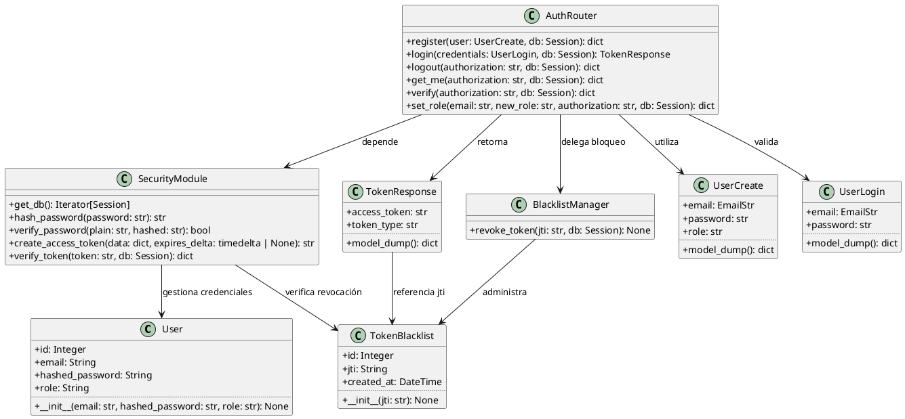
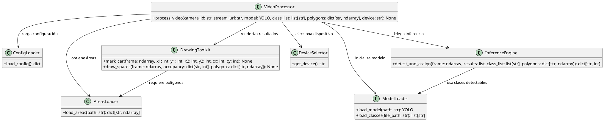
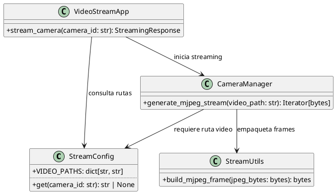
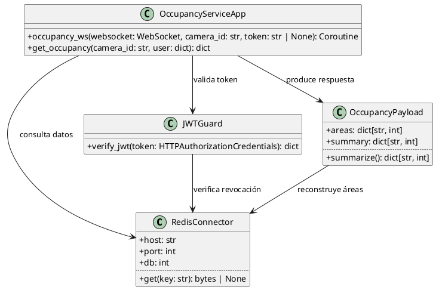
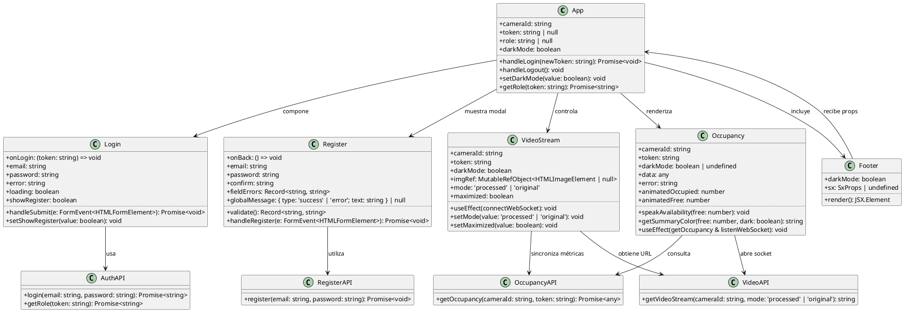

# Información para diagrama de clases UML

Este documento resume las clases, estructuras de datos y responsabilidades relevantes del proyecto **findParking** para facilitar la elaboración de un diagrama de clases UML. Cada microservicio se representa con tablas que siguen el formato solicitado (`Classname`, `+ field: type`, `+ method(type): type`).

## Auth Service (`api/auth/app`)

| Classname | Atributos | Métodos |
| --- | --- | --- |
| AuthService | **User** `+ id: Integer` `+ email: String` `+ hashed_password: String` `+ role: String`  **TokenBlacklist** `+ id: Integer` `+ jti: String` `+ created_at: DateTime`  **UserCreate** `+ email: EmailStr` `+ password: str` `+ role: str`  **UserLogin** `+ email: EmailStr` `+ password: str`  **TokenResponse** `+ access_token: str` `+ token_type: str`  **AuthRouter** `—`  **SecurityModule** `—`  **BlacklistManager** `—` | **User** `+ __init__(email: str, hashed_password: str, role: str): None`  **TokenBlacklist** `+ __init__(jti: str): None`  **UserCreate / UserLogin / TokenResponse** `+ model_dump(): dict`  **AuthRouter** `+ register(user: UserCreate, db: Session): dict` `+ login(credentials: UserLogin, db: Session): TokenResponse` `+ logout(Authorization: str, db: Session): dict` `+ get_me(Authorization: str, db: Session): dict` `+ verify(Authorization: str, db: Session): dict` `+ set_role(email: str, new_role: str, Authorization: str, db: Session): dict`  **SecurityModule** `+ get_db(): Iterator[Session]` `+ hash_password(password: str): str` `+ verify_password(plain: str, hashed: str): bool` `+ create_access_token(data: dict, expires_delta: timedelta \| None): str` `+ verify_token(token: str, db: Session): dict`  **BlacklistManager** `+ revoke_token(jti: str, db: Session): None` |

## Processing Service (`vision/processing`)

| Classname | Atributos | Métodos |
| --- | --- | --- |
| ProcessingService | **ConfigLoader** `—`  **AreasLoader** `—`  **ModelLoader** `—`  **DeviceSelector** `—`  **InferenceEngine** `—`  **DrawingToolkit** `—`  **VideoProcessor** `—` | **ConfigLoader** `+ load_config(): dict`  **AreasLoader** `+ load_areas(path: str): dict[str, ndarray]`  **ModelLoader** `+ load_model(path: str): YOLO` `+ load_classes(file_path: str): list[str]`  **DeviceSelector** `+ get_device(): str`  **InferenceEngine** `+ detect_and_assign(frame: ndarray, results: list, class_list: list[str], polygons: dict[str, ndarray]): dict[str, int]`  **DrawingToolkit** `+ mark_car(frame: ndarray, x1: int, y1: int, x2: int, y2: int, cx: int, cy: int): None` `+ draw_spaces(frame: ndarray, occupancy: dict[str, int], polygons: dict[str, ndarray]): None`  **VideoProcessor** `+ process_video(camera_id: str, stream_url: str, model: YOLO, class_list: list[str], polygons: dict[str, ndarray], device: str): None` |

## Video Stream Service (`vision/video_stream`)

| Classname | Atributos | Métodos |
| --- | --- | --- |
| VideoStreamService | **StreamConfig** `+ VIDEO_PATHS: dict[str, str]`  **StreamUtils** `—`  **CameraManager** `—`  **VideoStreamApp** `—` | **StreamConfig** `+ get(camera_id: str): str \| None`  **StreamUtils** `+ build_mjpeg_frame(jpeg_bytes: bytes): bytes`  **CameraManager** `+ generate_mjpeg_stream(video_path: str): Iterator[bytes]`  **VideoStreamApp** `+ stream_camera(camera_id: str): StreamingResponse` |

## Occupancy Service (`api/occupancy`)

| Classname | Atributos | Métodos |
| --- | --- | --- |
| OccupancyService | **RedisConnector** `+ host: str` `+ port: int` `+ db: int`  **JWTGuard** `—`  **OccupancyServiceApp** `—`  **OccupancyPayload** `+ areas: dict[str, int]` `+ summary: dict[str, int]` | **RedisConnector** `+ get(key: str): bytes \| None`  **JWTGuard** `+ verify_jwt(token: HTTPAuthorizationCredentials): dict`  **OccupancyServiceApp** `+ occupancy_ws(websocket: WebSocket, camera_id: str, token: str \| None): Coroutine[None, None, None]` `+ get_occupancy(camera_id: str, user: dict): dict`  **OccupancyPayload** `+ summarize(): dict[str, int]` |

## Front-End Service (`ui/frontend`)

| Classname | Atributos | Métodos |
| --- | --- | --- |
| FrontEndService | **App** `+ cameraId: string` `+ token: string \| null` `+ role: string \| null` `+ darkMode: boolean`  **Login** `+ onLogin: (token: string) => void` `+ email: string` `+ password: string` `+ error: string` `+ loading: boolean` `+ showRegister: boolean`  **Register** `+ onBack: () => void` `+ email: string` `+ password: string` `+ confirm: string` `+ fieldErrors: Record<string, string>` `+ globalMessage: { type: 'success' \| 'error'; text: string } \| null`  **Occupancy** `+ cameraId: string` `+ token: string` `+ darkMode: boolean \| undefined` `+ data: any` `+ error: string` `+ animatedOccupied: number` `+ animatedFree: number`  **VideoStream** `+ cameraId: string` `+ token: string` `+ darkMode: boolean` `+ imgRef: MutableRefObject<HTMLImageElement \| null>` `+ mode: 'processed' \| 'original'` `+ maximized: boolean`  **Footer** `+ darkMode: boolean` `+ sx: SxProps \| undefined`  **AuthAPI** `—`  **RegisterAPI** `—`  **OccupancyAPI** `—`  **VideoAPI** `—` | **App** `+ handleLogin(newToken: string): Promise<void>` `+ handleLogout(): void` `+ setDarkMode(value: boolean): void` `+ getRole(token: string): Promise<string>`  **Login** `+ handleSubmit(e: FormEvent<HTMLFormElement>): Promise<void>` `+ setShowRegister(value: boolean): void`  **Register** `+ validate(): Record<string, string>` `+ handleRegister(e: FormEvent<HTMLFormElement>): Promise<void>`  **Occupancy** `+ speakAvailability(free: number): void` `+ getSummaryColor(free: number, dark: boolean): string` `+ useEffect(getOccupancy \& listenWebSocket): void`  **VideoStream** `+ useEffect(connectWebSocket): void` `+ setMode(value: 'processed' \| 'original'): void` `+ setMaximized(value: boolean): void`  **Footer** `+ render(): JSX.Element`  **AuthAPI** `+ login(email: string, password: string): Promise<string>` `+ getRole(token: string): Promise<string>`  **RegisterAPI** `+ register(email: string, password: string): Promise<void>`  **OccupancyAPI** `+ getOccupancy(cameraId: string, token: string): Promise<any>`  **VideoAPI** `+ getVideoStream(cameraId: string, mode: 'processed' \| 'original'): string` |

## Relaciones inter-servicio sugeridas

| Origen | Destino | Descripción |
| --- | --- | --- |
| Processing Service | RedisConnector | Publica frames procesados y estados de ocupación consumidos por otros servicios. |
| Occupancy Service | RedisConnector | Consulta los estados de ocupación generados por el servicio de procesamiento. |
| Video Stream Service | Processing Service | Provee streams MJPEG como fuente de video para la inferencia. |
| Auth Service | Occupancy Service | Los tokens emitidos por Auth se validan antes de exponer datos de ocupación. |
| Front-End Service | Auth / Video Stream / Occupancy | Consume autenticación, video y ocupación para la experiencia del usuario final. |

## Recomendaciones para el diagrama UML

1. **Incluir todos los microservicios:** Modelar Auth, Processing, Video Stream y Occupancy con el mismo nivel de detalle en atributos y operaciones.
2. **Resaltar atributos críticos:** Roles, identificadores de tokens y estructuras de ocupación ayudan a comprender la seguridad y el flujo de datos.
3. **Anotar dependencias tecnológicas:** Mostrar conexiones con Redis, base de datos SQL, OpenCV, Ultralytics y Torch según corresponda.
4. **Integrar actores externos:** Usuario final, sistema de cámaras y cualquier cliente que consuma los endpoints.

Esta estructura proporciona la base necesaria para construir un diagrama de clases UML equilibrado entre microservicios y, de ser necesario, extenderlo a diagramas de componentes o despliegue.

## Código PlantUML por microservicio

### Auth Service

### Processing Service

### Video Stream Service

### Occupancy Service

### Front-End Service

