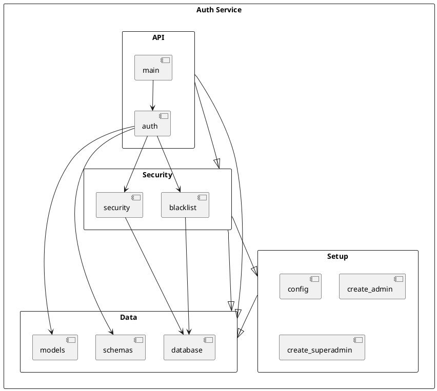
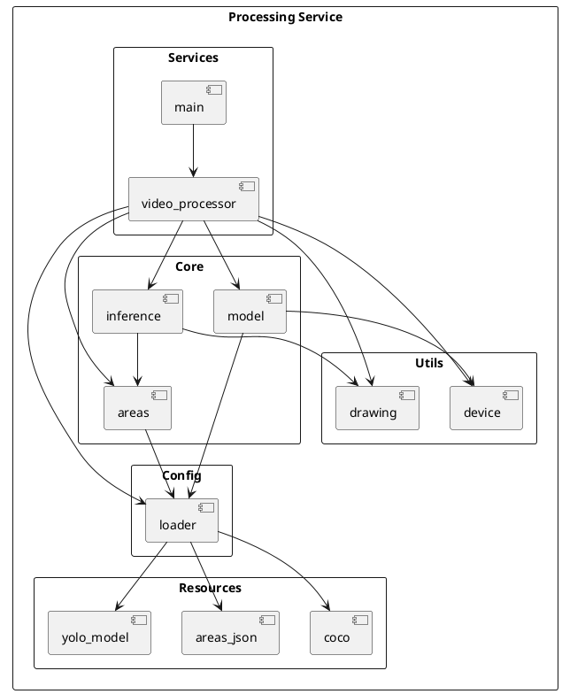
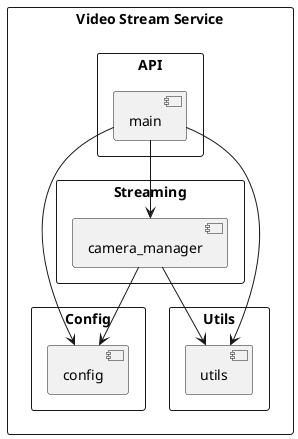
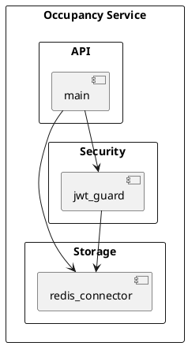
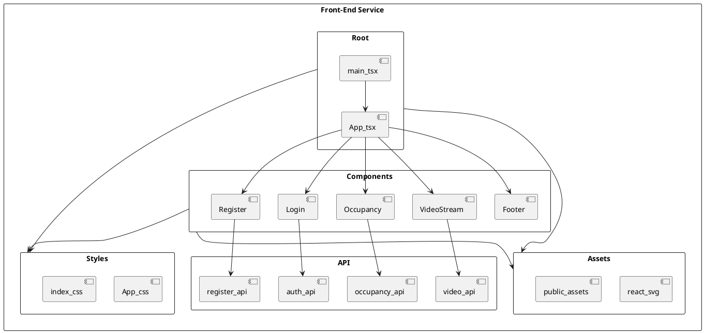

# Información para diagrama de paquetes UML

Este documento complementa la guía de clases aportando una vista de paquetes para cada microservicio de **findParking**. Cada sección lista los paquetes relevantes, sus componentes y dependencias, seguida de un bloque PlantUML independiente (marcado con `@startuml` y `@enduml`) listo para generar el diagrama correspondiente.

## Auth Service (`api/auth/app`)

| Paquete | Elementos principales | Responsabilidad | Dependencias clave |
| --- | --- | --- | --- |
| `app.api` | `auth.py`, `main.py` | Exponer endpoints REST de autenticación. | `app.security`, `app.schemas`, `app.models`, `app.database` |
| `app.security` | `security.py`, `blacklist.py` | Generar/verificar tokens JWT y gestionar el blacklist. | `app.database`, `app.models`, `app.config` |
| `app.data` | `models.py`, `schemas.py`, `database.py` | Persistencia SQLAlchemy y validación Pydantic. | Base de datos relacional |
| `app.setup` | `config.py`, `create_admin.py`, `create_superadmin.py` | Configuración y scripts de arranque. | `app.data`, servicios externos |

## Processing Service (`vision/processing`)

| Paquete | Elementos principales | Responsabilidad | Dependencias clave |
| --- | --- | --- | --- |
| `config` | `loader.py` | Lectura de configuraciones y rutas de recursos. | `resources` |
| `core` | `model.py`, `areas.py`, `inference.py` | Preparación del modelo YOLO, polígonos y lógica de inferencia. | `config`, `utils.device`, `utils.drawing` |
| `utils` | `device.py`, `drawing.py` | Servicios auxiliares para hardware y overlay visual. | `torch`, `opencv`, `numpy` |
| `services` | `video_processor.py`, `main.py` | Orquestación de la ingesta de video y publicación de resultados. | `core`, `config`, `resources` |
| `resources` | `coco.txt`, `areas.json`, `yolo11n.pt` | Datos estáticos para inferencia y etiquetado. | — |

## Video Stream Service (`vision/video_stream`)

| Paquete | Elementos principales | Responsabilidad | Dependencias clave |
| --- | --- | --- | --- |
| `app.api` | `main.py` | Publicar endpoints FastAPI para streaming MJPEG. | `camera_manager`, `config`, `utils` |
| `app.streaming` | `camera_manager.py` | Gestionar la lectura de video y generar frames. | `config`, `utils`, `cv2` |
| `app.config` | `config.py` | Definir rutas de cámaras y ajustes del servicio. | Sistema de archivos |
| `app.utils` | `utils.py` | Transformaciones de frames en respuestas streaming. | `fastapi.responses` |

## Occupancy Service (`api/occupancy`)

| Paquete | Elementos principales | Responsabilidad | Dependencias clave |
| --- | --- | --- | --- |
| `app.api` | `main.py` | Gestionar WebSocket y endpoints REST de ocupación. | `redis`, `auth`, `schemas` |
| `app.storage` | (integrado en `main.py`) | Acceso a Redis para estados de ocupación. | `redis.asyncio`, `config` |
| `app.security` | (integrado en `main.py`) | Validación JWT antes de servir datos. | Servicio Auth |

## Front-End Service (`ui/frontend/src`)

| Paquete | Elementos principales | Responsabilidad | Dependencias clave |
| --- | --- | --- | --- |
| `app.root` | `main.tsx`, `App.tsx` | Punto de entrada y layout principal. | `components`, `api` |
| `app.components` | `components/*.tsx` | Componentes de UI para autenticación, video y ocupación. | `app.api`, `app.root`, `hooks` de React |
| `app.api` | `api/*.ts` | Clientes HTTP/WebSocket para servicios backend. | `fetch`, `WebSocket`, servicios Auth/Video/Occupancy |
| `app.styles` | `App.css`, `index.css` | Estilos globales y de componentes. | `app.components` |
| `app.assets` | `assets/react.svg`, `public/*` | Recursos estáticos. | `app.root` |

## Sugerencias para integrar los diagramas

1. **Mantener coherencia con los diagramas de clases:** alinear los paquetes con las clases clave presentadas en `uml_class_diagram_info.md` para preservar el contexto.
2. **Mostrar dependencias inter-servicio:** complementar cada diagrama con notas o conectores hacia paquetes externos cuando se construya un diagrama de nivel global.
3. **Resaltar componentes reutilizables:** los paquetes `utils`, `security` y `api` concentran la lógica compartida; enfatizarlos ayuda a identificar puntos de extensión.
