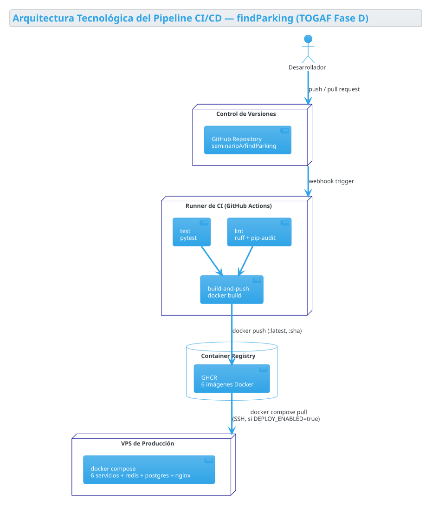
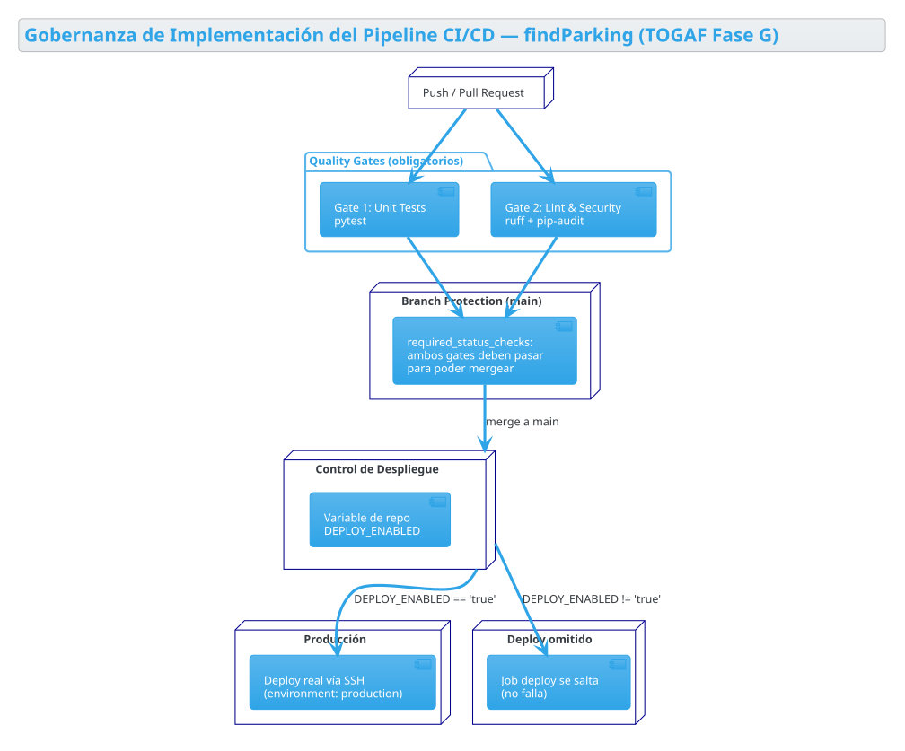

# CI/CD Pipeline (GitHub Actions)

Documentación del workflow [`ci-cd-pipeline.yml`](../../.github/workflows/ci-cd-pipeline.yml): qué corre, en qué orden, y qué condiciones determinan si un job se ejecuta o se salta.

Los diagramas son monocromáticos (pensados para poder imprimirse) y usan el mismo tipo de gráfico (diagrama de despliegue/componentes: `node`/`package`/`database`). La clasificación TOGAF de cada uno vive en esta página, no en el propio diagrama.

## Diagrama 1 — Arquitectura Tecnológica del Pipeline

Componentes tecnológicos y su topología: repositorio, runner de CI, registry de contenedores y el VPS de producción.

Fuente PlantUML: [`diagrams/pipeline-technology-architecture.puml`](diagrams/pipeline-technology-architecture.puml)

📎 Ficha del diagrama (click para expandir)

**Tipo de diagrama:** Diagrama de despliegue / componentes (PlantUML)

---

**Framework:** TOGAF
**Fase:** D — Arquitectura de Tecnología
**Justificación de la fase:** describe qué plataformas y herramientas existen (VCS, runner de CI, registry, VPS) y cómo están topológicamente conectadas entre sí -- exactamente el alcance de la Fase D. No entra en reglas de gobernanza/control de flujo (eso es el Diagrama 2, en su propia fase).

---

**Autor:** Alejandro Valentino Seminario Medina

---

**Versión del gráfico:** v0.0001

## Diagrama 2 — Gobernanza de Implementación del Pipeline

Los puntos de control reales que gobiernan si el código avanza: los 2 quality gates obligatorios (`test`, `lint`), la regla de branch protection que exige que ambos pasen antes de mergear a `main`, y la variable de repo `DEPLOY_ENABLED` que decide si el deploy a producción corre o se salta.

Fuente PlantUML: [`diagrams/pipeline-governance.puml`](diagrams/pipeline-governance.puml)

📎 Ficha del diagrama (click para expandir)

**Tipo de diagrama:** Diagrama de despliegue / componentes (PlantUML)

---

**Framework:** TOGAF
**Fase:** G — Gobernanza de la Implementación
**Justificación de la fase:** describe los controles/gates que aseguran conformidad antes de que algo llegue a producción (quality gates obligatorios, branch protection, el flag manual de despliegue) -- exactamente el alcance de la Fase G. No se mezcla con la Fase D del Diagrama 1.

---

**Autor:** Alejandro Valentino Seminario Medina

---

**Versión del gráfico:** v0.0001

## Notas

- `test` y `lint` corren siempre (push y pull request), en paralelo.
- `build-and-push` y `deploy` solo corren en push a `main` — nunca en PRs ni en push a `dev`/`test`.
- `deploy` además requiere la variable de repo `DEPLOY_ENABLED=true`; mientras no exista, el job se salta (no falla).
