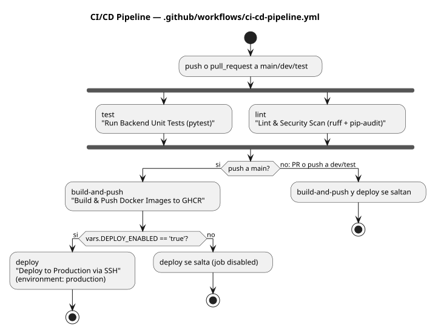
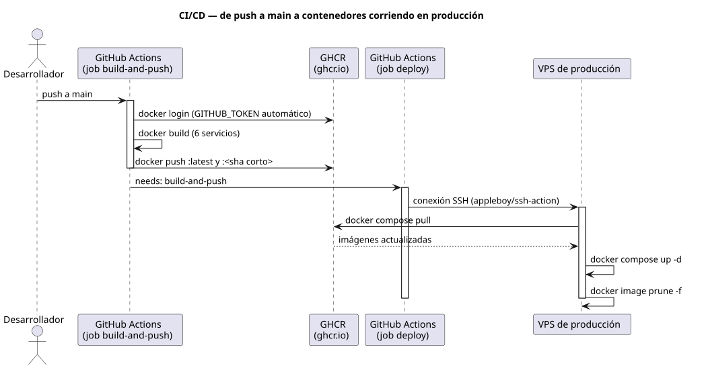

# CI/CD Pipeline (GitHub Actions)

Documentación del workflow [`ci-cd-pipeline.yml`](../../.github/workflows/ci-cd-pipeline.yml): qué corre, en qué orden, y qué condiciones determinan si un job se ejecuta o se salta.

## Diagrama 1 — Vista general del pipeline

Muestra los 4 jobs (`test`, `lint`, `build-and-push`, `deploy`) y las condiciones (`if:`) que deciden si `build-and-push` y `deploy` corren o se saltan según el evento y la rama.

Fuente PlantUML: [`diagrams/pipeline-overview.puml`](diagrams/pipeline-overview.puml)

## Diagrama 2 — Secuencia de build & deploy

Detalla qué pasa desde que se hace push a `main` hasta que los contenedores quedan corriendo en el VPS de producción: build-and-push construye y publica en GHCR, y deploy hace `docker compose pull/up` sobre el host remoto vía SSH.

Fuente PlantUML: [`diagrams/deploy-sequence.puml`](diagrams/deploy-sequence.puml)

## Notas

- `test` y `lint` corren siempre (push y pull request), en paralelo.
- `build-and-push` y `deploy` solo corren en push a `main` -- nunca en PRs ni en push a `dev`/`test`.
- `deploy` además requiere la variable de repo `DEPLOY_ENABLED=true`; mientras no exista, el job se salta (no falla).

---

📎 Nota de clasificación (click para expandir)

Ambos diagramas de esta página pertenecen a una única fase de TOGAF ADM: **Fase D — Arquitectura de Tecnología**. Describen la topología de infraestructura de build/despliegue (runners de CI, registry de contenedores, host de producción) y las herramientas/plataformas que la implementan, que es exactamente el alcance de la Fase D (no se mezcla con Fase B/C ni con Fase G).

